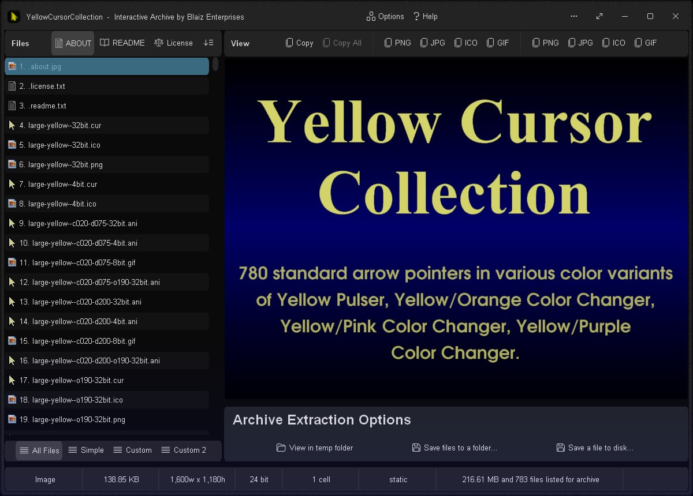
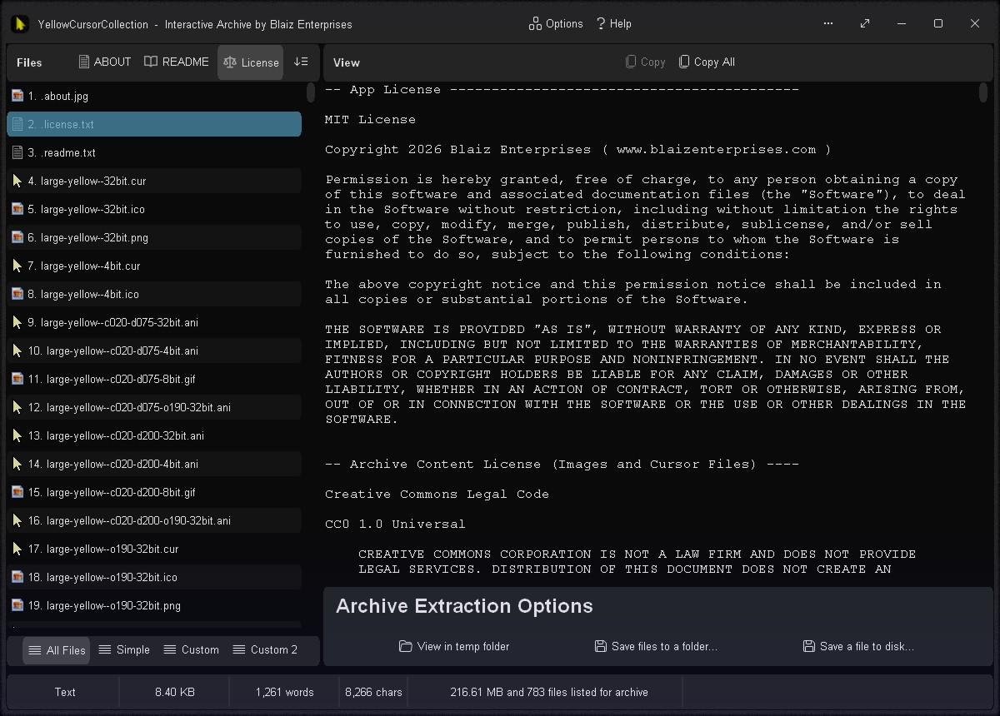
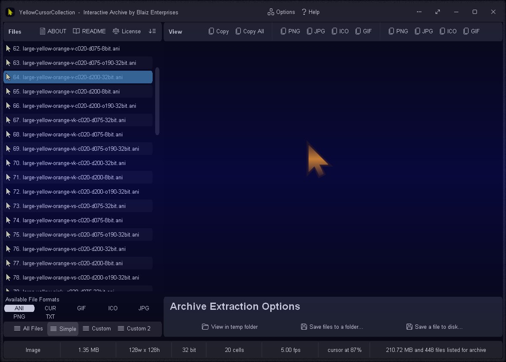
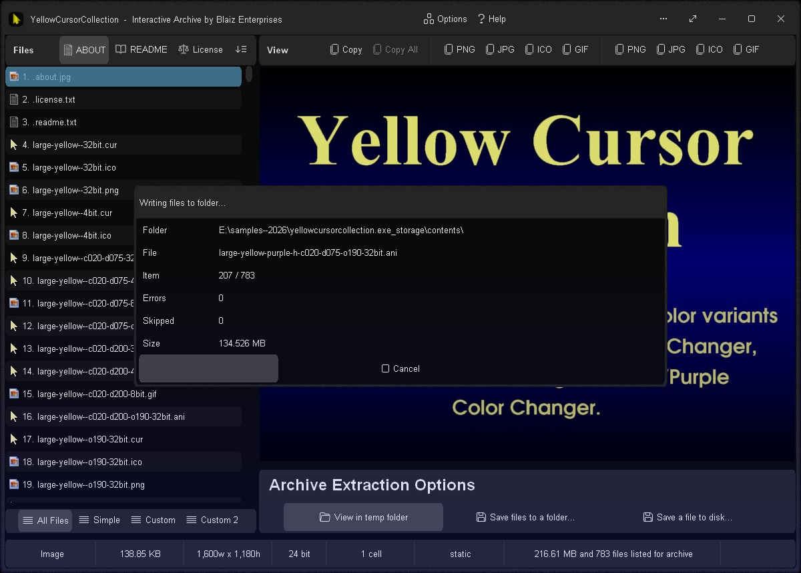
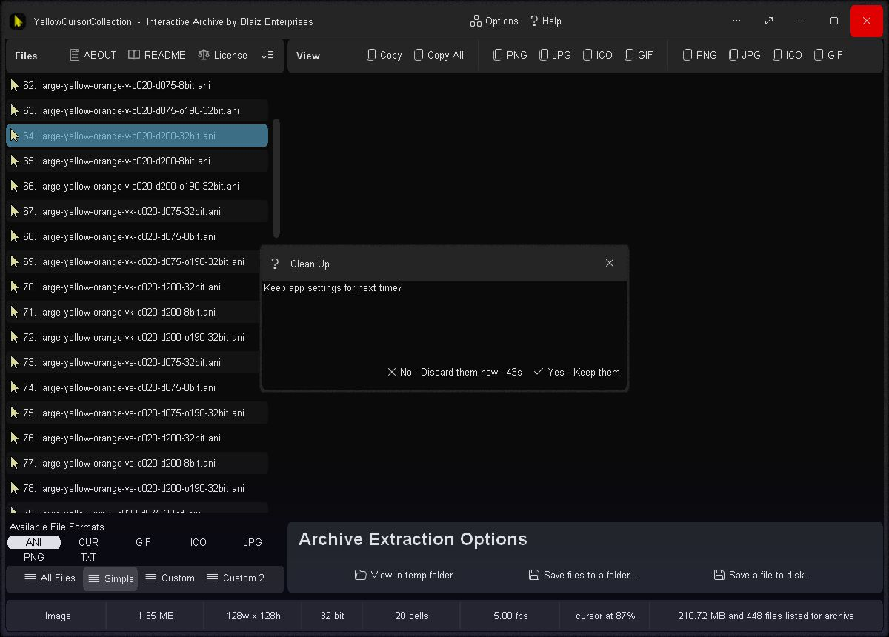

# Yellow Cursor Collection v2.0.77 / 19may2026 / MIT License
780 standard arrow pointers in an Interactive Archive with various color and animation variants.

# Features
* Realtime WYSIWYG (What You See Is What You Get) preview panel for viewing cursors correctly at their native size
* Realtime mouse pointer preview - hover over the preview panel to show the cursor at your computer's current size/scaling
* File List Modes: All Files, Simple, Custom, and Custom 2 - set which files to list/extract
* Extraction Methods: View in temp folder (one click fuss free + auto clean up), Save files to a folder, and Save a file to disk
* Cursor Options: Set as Arrow, Set as Hand, Redo, Undo, Mouse Properties (Windows Dialog), and Mouse & Touch (Windows Settings Page)
* Desktop Background Options: Set This Monitor, Set All Monitors (if 2+ monitors), Redo, Undo, and Personalisation (Windows Settings Page)
* Option: On close of app choose whether to discard its settings and leave no trace behind
* Cursor Styles: Yellow Pulser, Yellow/Orange Color Changer, Yellow/Pink Color Changer, Yellow/Purple Color Changer
* Visual Effects: Sparkles, Vertical and Horizontal Shading, Vertical and Horizontal Scrolling Stripes, Color Cycling, Inverse Color Cycling, Opaque and Translucent, Fast and Slow Animations.
* Animated Formats: Animated Cursor (.ani) and Animated GIF (.gif)
* Static Formats: Cursor (.cur), Icon (.ico) and Portable Network Graphic (.png)
* Color Depths: 32-bit, 8-bit, and 4-bit
* Dimensions: Small 32px (~25% coverage), Medium 32px (~50% coverage) and Large 128px (~45% coverage)
* Options Window - Easily change app color, font, and settings
* Portable
* Smart Source Code (Borland Delphi 3 and Lazarus 2.2/4.4/4.6)

# Codebase Changes
* Source code supports both 32-bit and 64-bit
* 32-bit compilation in Borland Delphi 3 (stable)
* 32-bit compilation in Lazarus 2.2 (stable)
* 64-bit compilation in Lazarus 4.4+ (possible/not stable/work in progress)

# Download
Download <a href="src/yellowcursorcollection.exe">yellowcursorcollection.exe</a> or from the "<a href="bin/">bin</a>" or "<a href="src/">src</a>" folders above - for Microsoft Windows, and Linux/MacOS via Wine.

# Images

